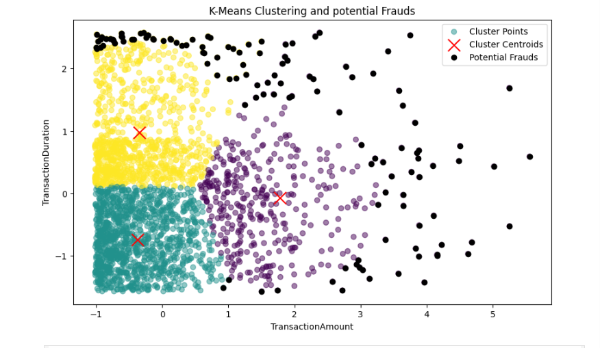
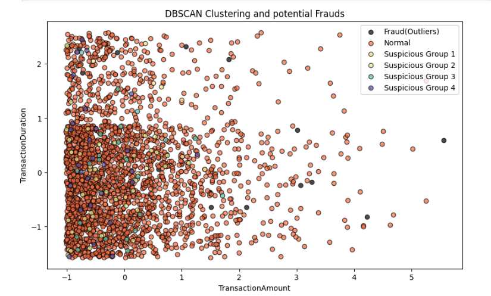
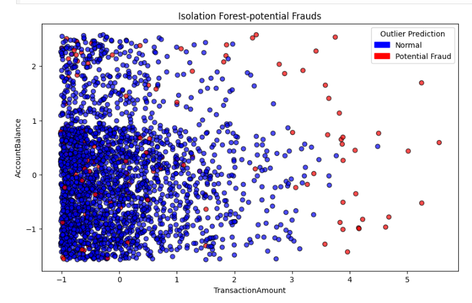
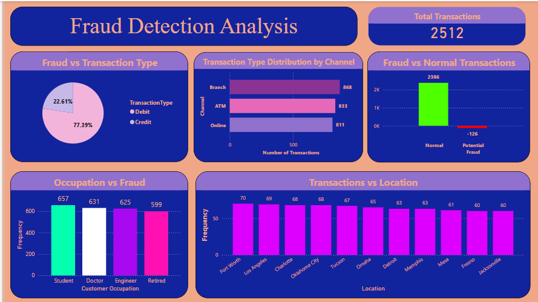

# fraud_detection

# 🚨 Advanced Fraud Detection System with Machine Learning & Power BI

> “Data is the new oil, and insight is the new gold.” – Clive Humby

Welcome to my Advanced Fraud Detection project! This project focuses on detecting potentially fraudulent financial transactions using Machine Learning techniques and turning insights into an intuitive dashboard using Power BI.

## 🔍 Project Overview

In this project, we tackled the problem of identifying fraudulent transactions within a large financial dataset. Fraud detection is a critical issue in the banking and fintech industries, and our aim was to detect anomalies and hidden patterns using unsupervised learning techniques.

### ✅ Objectives
- Preprocess and clean real-world transaction data.
- Detect anomalies and frauds using clustering and outlier detection algorithms.
- Visualise key fraud insights with Power BI.

---

## 💡 Key Features

- 📊 **Data Cleaning & Preprocessing** using `pandas`, `numpy`.
- 🤖 **Anomaly Detection Models**:  
  - `KMeans Clustering`  
  - `DBSCAN`  
  - `Isolation Forest`  
  - `Local Outlier Factor (LOF)`
- 📈 **Exploratory Data Analysis** using `matplotlib` & `seaborn`.
- 📌 **Power BI Dashboard** for fraud insights and reporting.
- 🔁 Reusable and scalable notebook format for future datasets.

---

## 🛠️ Tech Stack

| Tool/Language | Purpose |
|---------------|---------|
| Python        | Data Preprocessing & ML Algorithms |
| Pandas, NumPy | Data manipulation |
| Matplotlib, Seaborn | Data Visualisation |
| scikit-learn  | Machine Learning Models |
| Power BI      | Dashboard and Reporting |

---

## 📂 Dataset Overview

The dataset contains various features related to customer transactions:

- **TransactionID**, **AccountID**, **TransactionAmount**, **TransactionDate**
- **DeviceID**, **IP Address**, **Channel**, **CustomerOccupation**, **CustomerAge**
- **BalanceChange**, **TransactionHour**, **TransactionDuration**
- **Cluster**, **DBSCAN_Cluster**, **AnomalyScore**, **IsAnomaly**

---

## 📌 ML Algorithms Used

### 🔷 KMeans Clustering
Used to group similar transactions based on behaviour and detect outliers lying far from their cluster centroid.

### 🔷 DBSCAN
Density-based clustering technique to find high-density regions and flag sparse points as outliers.

### 🔷 Isolation Forest
An ensemble-based anomaly detection model effective for high-dimensional data.

### 🔷 Local Outlier Factor (LOF)
Used to identify anomalies based on local deviation from the neighbourhood.

---

## 📊 Power BI Dashboard Highlights

- Total and average transaction distribution
- Fraud vs non-fraud summary cards
- Fraud distribution by occupation, device, location
- Dynamic filtering using slicers for Channel, CustomerAge, and Cluster
- Visual representation of anomaly scores and clusters

---

## 📊 Visual Representations of Fraud Detection Techniques

| K-Means Clustering | DBSCAN Clustering |
|--------------------|-------------------|
|  |  |

| Isolation Forest | Dashboard Overview |
|------------------|--------------------|
|  |  |

## 🧠 What I Learned

- Practical implementation of unsupervised learning for real-time fraud detection.
- Data preprocessing and transformation skills.
- Designing professional dashboards in Power BI.
- Team collaboration and project presentation skills.

---

## 🤝 Acknowledgements

This project was completed during my internship at **InfoTact Solutions** under the guidance of mentor **Chandan Mishra** and team lead **Manoj Sriram**. The entire journey involved weekly reviews, collaborative teamwork, and a final evaluation that sharpened my analytical and problem-solving mindset.

---

